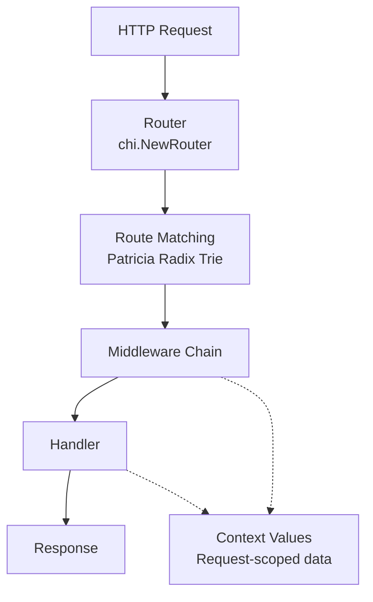

# Overview

<!-- Maintained by Tidewiki. Edits are kept on later updates; wrap text in tidewiki:keep markers to freeze it. -->

chi is a lightweight, idiomatic HTTP router for building Go services. [`README.md:6-9`](../../README.md#L6-L9) It's designed especially for REST APIs that need to stay maintainable as they grow, using Go's `context` package to manage request-scoped values and signaling across handler chains. [`README.md:8-9`](../../README.md#L8-L9)

The router itself is compact—under 1000 lines of code [`README.md:30`](../../README.md#L30)—yet powerful enough for production use at companies like Pressly, Cloudflare, and Heroku. [`README.md:35`](../../README.md#L35) chi works with 100% standard `net/http` interfaces, so any ecosystem middleware compatible with the standard library will work with chi. [`README.md:32`](../../README.md#L32)

## Key Building Blocks

chi organizes HTTP request handling around three main concepts:



**Router**: [`README.md:185-234`](../../README.md#L185-L234) The core `Router` interface provides methods like `Get()`, `Post()`, `Route()`, and `Use()` to define and compose request handlers. You create one with `chi.NewRouter()`.

**Route Matching**: [`README.md:177-178`](../../README.md#L177-L178) chi uses a Patricia Radix trie for fast, efficient route matching. Routes support named parameters (e.g., `/users/{userID}`), wildcards, and regex patterns. [`README.md:252-255`](../../README.md#L252-L255)

**Middleware & Handlers**: [`README.md:260-263`](../../README.md#L260-L263) Middlewares are standard `net/http` handlers with no special chi magic. They wrap handlers and can pass request-scoped values through Go's `context` package. [`README.md:269-286`](../../README.md#L269-L286)

**Context Values**: [`README.md:310-328`](../../README.md#L310-L328) URL parameters and custom data live on the request context. Retrieve them with `chi.URLParam(r, "paramName")` or `r.Context().Value("key")`.

## Quick Start

Install chi:

```sh
go get -u github.com/go-chi/chi/v5
```

Here's a minimal example: [`README.md:48-66`](../../README.md#L48-L66)

```go
package main

import (
	"net/http"
	"github.com/go-chi/chi/v5"
	"github.com/go-chi/chi/v5/middleware"
)

func main() {
	r := chi.NewRouter()
	r.Use(middleware.Logger)
	r.Get("/", func(w http.ResponseWriter, r *http.Request) {
		w.Write([]byte("welcome"))
	})
	http.ListenAndServe(":3000", r)
}
```

For a production baseline, [`README.md:86-97`](../../README.md#L86-L97) apply these core middlewares:

```go
r := chi.NewRouter()
r.Use(middleware.RequestID)
r.Use(middleware.Logger)
r.Use(middleware.Recoverer)
r.Use(middleware.Timeout(60 * time.Second))
```

## Wiki Structure

**Foundation**
- [Getting Started](getting-started.md) — Installation and core concepts
- [Routing Basics](routing-basics.md) — Define routes with patterns and HTTP methods
- [Route Matching and Tree](route-matching-tree.md) — How chi's trie router works under the hood

**Middleware & Request Handling**
- [Middleware Fundamentals](middleware-fundamentals.md) — Build and compose standard net/http middleware
- [Context Values and Request Handling](context-values.md) — Access URL parameters and pass request-scoped data
- [Built-in Middleware](built-in-middleware.md) — Reference of 25+ production-ready middlewares
- [Logging and Error Recovery](middleware-logging-recovery.md) — Request logging and panic handling
- [Security and Request Filtering](middleware-security.md) — Headers, rate limiting, request filtering
- [Content Encoding and Compression](middleware-content-handling.md) — Content negotiation and compression
- [Advanced Middleware Patterns](middleware-advanced.md) — Real IP detection, request IDs, conditional logic

**Examples**
- [REST API Examples](examples-rest-api.md) — Modular API design, versioning, graceful shutdown
- [Specialized Examples](examples-specialized.md) — Custom methods, monitoring, routing introspection

## Middleware Ecosystem

chi ships with 25+ built-in middlewares [`README.md:338-369`](../../README.md#L338-L369) covering logging, compression, authentication, rate limiting, and more. Beyond that, [`README.md:478-493`](../../README.md#L478-L493) the go-chi organization maintains additional packages like CORS, JWT auth, rate limiting, and structured logging.

All middlewares follow the standard `func(http.Handler) http.Handler` signature, so they work with any Go HTTP router or framework.

## Running the Tests

To verify the code locally: [`Makefile:8-18`](../../Makefile#L8-L18)

```bash
make test          # Run all tests
make test-router   # Test core router
make test-middleware  # Test middleware package
```

[`CONTRIBUTING.md:5-11`](../../CONTRIBUTING.md#L5-L11) You'll need Go installed. Clone the repository and cd into it to run these commands.

## Decisions

**Minimum Go version bumped to 1.24** (commit 756fcb8d630f): Chi now requires Go 1.24 or later to use `b.Loop()` and keep up with recent Go releases. The project supports the four most recent major versions of Go.

**Middleware documentation links updated to chi/v5** (commit 167e1e3bd039): All middleware package links now point to `github.com/go-chi/chi/v5` on pkg.go.dev instead of the older module path. This ensures documentation for all middlewares, including newer ones like `ClientIP`, is accessible and current.
